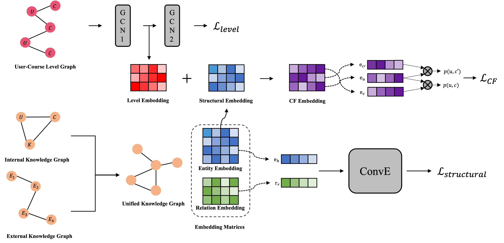

# KPCR : Knowledge graph enhanced Personalized Course Recommendation


<!-- PROJECT SHIELDS -->
<!--
*** I'm using markdown "reference style" links for readability.
*** Reference links are enclosed in brackets [ ] instead of parentheses ( ).
*** See the bottom of this document for the declaration of the reference variables
*** for contributors-url, forks-url, etc. This is an optional, concise syntax you may use.
*** https://www.markdownguide.org/basic-syntax/#reference-style-links
-->

paper : [KPCR : Knowledge graph enhanced Personalized Course Recommendation](https://link.springer.com/chapter/10.1007/978-3-030-97546-3_60)


## Model Architecture
 


## Experiments

### Datasets 
- [ESOF](https://www.ebssw.kr/)
- [XuetangX](https://www.xuetangx.com/)


### Metrics

- Recall [(Recall@K)](https://en.wikipedia.org/wiki/Precision_and_recall)
- Normalized Discounted Cumulative Gain [(NDCG@K)](https://en.wikipedia.org/wiki/Discounted_cumulative_gain)


### Performance

#### * ESOF
| Model | Recall@5 | Recall@10 | NDCG@5 | NDCG@10 |
|-------|----------|-----------|--------|---------|
| KPCR(L+S) | 0.633 | 0.728 | 0.628 | 0.659 |
| KPCR(S) | 0.618 | 0.712 | 0.618 | 0.648 |
| KPCR(Si) | 0.612 | 0.701 | 0.593 | 0.626 |
| KGAT | 0.602 | 0.701 | 0.510 | 0.542 |


#### * XuetangX
| Model | Recall@5 | Recall@10 | NDCG@5 | NDCG@10 |
|-------|----------|-----------|--------|---------|
| KPCR(L+S) | 0.503 | 0.609 | 0.450 | 0.489 |
| KPCR(S) | 0.498 | 0.589 | 0.448 | 0.483 |
| KPCR(Si) | 0.495 | 0.548 | 0.447 | 0.481 |
| KGAT | 0.452 | 0.548 | 0.404 | 0.439 |


## Requirements
* [torch](https://pytorch.org/) == 1.7.0
* [dgl-cu102](https://www.dgl.ai/) == 0.5.3

## Usage
1. Clone the repo
```sh
git clone https://github.com/14heeseok/KPCR_AI21.git
```
2. Run the codes
```sh
python3 main.py --kpcr_mode ls --dataset xue
```


<!-- CONTACT -->
## Contact

Heeseok Jung: poco2889@korea.ac.kr

Yeonju Jang: spring0425@korea.ac.kr

Project Link: [https://github.com/14heeseok/KPCR](https://github.com/14heeseok/KPCR)


<!-- ACKNOWLEDGEMENTS -->
## References
* [LunaBlack/KGAT-pytorch](https://github.com/LunaBlack/KGAT-pytorch)
* [TimDettmers/ConvE](https://github.com/TimDettmers/ConvE)


<!-- MARKDOWN LINKS & IMAGES -->
<!-- https://www.markdownguide.org/basic-syntax/#reference-style-links -->
[contributors-shield]: https://img.shields.io/github/contributors/othneildrew/Best-README-Template.svg?style=flat-square
[contributors-url]: https://github.com/othneildrew/Best-README-Template/graphs/contributors
[forks-shield]: https://img.shields.io/github/forks/othneildrew/Best-README-Template.svg?style=flat-square
[forks-url]: https://github.com/othneildrew/Best-README-Template/network/members
[stars-shield]: https://img.shields.io/github/stars/othneildrew/Best-README-Template.svg?style=flat-square
[stars-url]: https://github.com/othneildrew/Best-README-Template/stargazers
[issues-shield]: https://img.shields.io/github/issues/othneildrew/Best-README-Template.svg?style=flat-square
[issues-url]: https://github.com/othneildrew/Best-README-Template/issues
[license-shield]: https://img.shields.io/github/license/othneildrew/Best-README-Template.svg?style=flat-square
[license-url]: https://github.com/othneildrew/Best-README-Template/blob/master/LICENSE.txt
[linkedin-shield]: https://img.shields.io/badge/-LinkedIn-black.svg?style=flat-square&logo=linkedin&colorB=555
[linkedin-url]: https://linkedin.com/in/othneildrew
[product-screenshot]: images/screenshot.png
